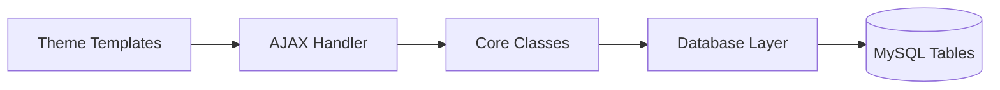

# 💪 Forma Real

**A modern fitness community forum built with WordPress + Custom OOP Plugin Architecture**

[](https://wordpress.org/)
[](https://php.net/)
[](LICENSE)

<p align="center">
  
</p>

## 🎯 Overview

**Forma Real** is a fully functional fitness community forum demonstrating advanced WordPress development skills. Built from scratch with a custom plugin architecture, custom database tables, and a modern UI design system.

### ✨ Key Features

| Feature | Description |
|---------|-------------|
| 🏛️ **Custom Plugin Architecture** | OOP-based plugin with Singleton pattern, dependency injection |
| 💾 **Custom Database Tables** | 6 custom tables for forums, topics, replies, notifications, profiles, reports |
| 🔔 **Real-time Notifications** | Dropdown with unread count, mark as read, animated badges |
| 🔍 **Full-text Search** | MySQL FULLTEXT search with relevance sorting |
| 🛡️ **Moderation System** | Report queue, ban system, moderator actions |
| 🎨 **Modern UI** | CSS variables, micro-animations, responsive design |

---

## 🏗️ Architecture



### Plugin Structure

```
forma-real-core/
├── forma-real-core.php          # Main plugin file, activation hooks
└── includes/
    ├── class-database.php       # Singleton DB handler with CRUD
    ├── class-forum.php          # Forum operations
    ├── class-topic.php          # Topic CRUD + search
    ├── class-reply.php          # Reply handling
    ├── class-notification.php   # Notification system
    ├── class-moderation.php     # Reports & bans
    ├── class-search.php         # Full-text search
    ├── class-ajax-handler.php   # REST-like AJAX endpoints
    └── class-helpers.php        # Utilities (time_ago, etc.)
```

---

## 🖥️ Screenshots

<details>
<summary>Click to expand screenshots</summary>

### Homepage
Modern hero section with community stats and recent activity.

### Forum Index
Category cards with topic counts and icons.

### Topic View
Clean reading experience with author info and reply form.

### Notifications Dropdown
Real-time notification badge with animated pulse.

### Moderation Panel
Admin queue for reviewing reported content.

</details>

---

## 🔧 Tech Stack

| Layer | Technology |
|-------|------------|
| **CMS** | WordPress 6.9 |
| **Backend** | PHP 8.0+ (OOP, Prepared Statements) |
| **Database** | MySQL with Custom Tables |
| **Frontend** | Vanilla CSS + JavaScript |
| **Fonts** | Barlow Condensed + Outfit (Google Fonts) |
| **Icons** | Inline SVG |
| **Dev Environment** | Laragon (Windows) |

---

## 🚀 Installation

### Prerequisites
- WordPress 6.0+
- PHP 8.0+
- MySQL 5.7+

### Quick Start

```bash
# 1. Clone the repository
git clone https://github.com/juliandeveloper05/forma-real.git

# 2. Copy to WordPress directory
cp -r forma-real/wp-content/* /path/to/wordpress/wp-content/

# 3. Activate the theme and plugin in WordPress Admin
# - Appearance → Themes → Activate "Forma Real Theme"
# - Plugins → Activate "Forma Real Core"

# 4. Run the seeder (requires admin login)
# Visit: http://your-site.test/seeder.php
```

---

## 📚 Documentation

| Document | Description |
|----------|-------------|
| [Technical Docs](docs/TECHNICAL.md) | Architecture, database schema, AJAX endpoints |
| [UI Update Guide](ACTUALIZACION_UI.md) | Design system and component updates |
| [Installation Guide](INSTRUCCIONES.md) | Step-by-step setup instructions |

---

## 🔌 AJAX Endpoints

| Endpoint | Auth | Description |
|----------|------|-------------|
| `fr_create_topic` | ✅ | Create new forum topic |
| `fr_create_reply` | ✅ | Add reply to topic |
| `fr_search` | ❌ | Full-text search |
| `fr_report_content` | ✅ | Report inappropriate content |
| `fr_get_notifications` | ✅ | Fetch user notifications |
| `fr_review_report` | 🛡️ | Moderator: process reports |

---

## 🎨 Design System

### Colors
```css
--color-primary: #2563eb    /* Blue */
--color-success: #10b981    /* Green */
--color-warning: #f59e0b    /* Yellow */
--color-danger: #ef4444     /* Red */
```

### Typography
- **Display:** Barlow Condensed (headings)
- **Body:** Outfit (content)

### Components
- Cards with subtle shadows and border-radius
- Animated badges and buttons
- Glass-morphism effects on modals

---

## 🛣️ Roadmap

- [x] Core forum functionality
- [x] Notification system
- [x] Moderation tools
- [x] Full-text search
- [x] Modern UI design
- [ ] Dark mode toggle
- [ ] Push notifications
- [ ] User reputation system
- [ ] Progressive Web App (PWA)

---

## 👨‍💻 Author

**Julian** - Full Stack Developer

- GitHub: [@juliandeveloper05](https://github.com/juliandeveloper05)
- Portfolio: Coming soon

---

## 📄 License

This project is licensed under the MIT License - see the [LICENSE](LICENSE) file for details.

---

<p align="center">
  <strong>Built with 💪 for the fitness community</strong><br>
  <sub>February 2026</sub>
</p>
