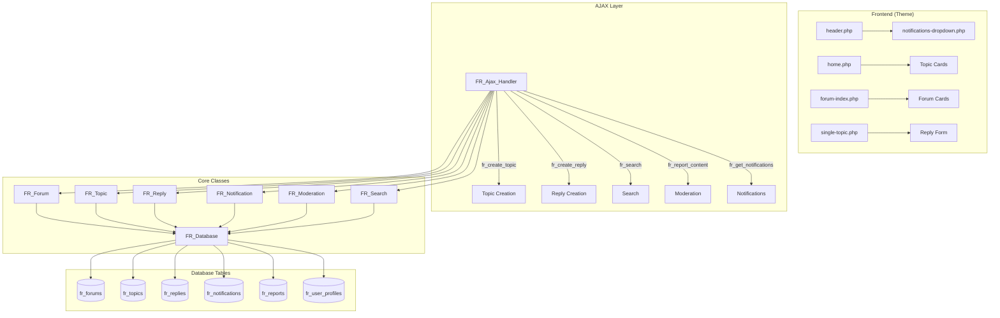

# Forma Real - Technical Documentation

## 📐 Architecture Diagram



## 🗄️ Database Schema

### `wp_fr_forums`
| Column | Type | Description |
|--------|------|-------------|
| id | BIGINT | Primary key |
| name | VARCHAR(200) | Forum name |
| slug | VARCHAR(200) | URL-friendly name |
| description | TEXT | Forum description |
| icon | VARCHAR(50) | Emoji icon |
| color | VARCHAR(7) | Hex color |
| parent_id | BIGINT | Parent forum (nullable) |
| display_order | INT | Sort order |
| topic_count | INT | Cached topic count |
| is_active | TINYINT | Active status |

### `wp_fr_topics`
| Column | Type | Description |
|--------|------|-------------|
| id | BIGINT | Primary key |
| forum_id | BIGINT | Parent forum |
| user_id | BIGINT | Author ID |
| title | VARCHAR(255) | Topic title |
| slug | VARCHAR(255) | URL-friendly title |
| content | LONGTEXT | Topic content |
| status | ENUM | pending/approved/spam/trash |
| is_sticky | TINYINT | Pinned topic |
| view_count | INT | View count |
| reply_count | INT | Reply count |

### `wp_fr_notifications`
| Column | Type | Description |
|--------|------|-------------|
| id | BIGINT | Primary key |
| user_id | BIGINT | Recipient user |
| type | VARCHAR(50) | reply/mention/moderation/system |
| content | TEXT | Notification text |
| link | VARCHAR(500) | Click destination |
| is_read | TINYINT | Read status |

---

## 🔌 AJAX Endpoints

### Authentication Required

| Action | Method | Description | Parameters |
|--------|--------|-------------|------------|
| `fr_create_topic` | POST | Create new topic | `title`, `content`, `forum_id`, `nonce` |
| `fr_create_reply` | POST | Create reply | `topic_id`, `content`, `nonce` |
| `fr_report_content` | POST | Report content | `content_type`, `content_id`, `reason`, `description`, `nonce` |
| `fr_mark_notification_read` | POST | Mark as read | `notification_id`, `nonce` |
| `fr_mark_all_notifications_read` | POST | Mark all read | `nonce` |
| `fr_get_notifications` | POST | Get notifications | - |

### Moderator Only

| Action | Method | Description | Parameters |
|--------|--------|-------------|------------|
| `fr_review_report` | POST | Process report | `report_id`, `action_type` (dismiss/warn/delete/ban), `nonce` |

### Public (No Auth)

| Action | Method | Description | Parameters |
|--------|--------|-------------|------------|
| `fr_search` | POST | Search topics | `query`, `page` |

---

## 📦 Class Reference

### FR_Database (Singleton)
Central database handler with CRUD methods.

```php
FR_Database::get_instance()           // Get singleton
->get_table('forums')                 // Get table name
->insert('topics', $data)             // Insert row
->update('topics', $data, $where)     // Update row
->delete('topics', $where)            // Delete row
->get_row('topics', $where)           // Get single row
->get_wpdb()                          // Access $wpdb
```

### FR_Forum
Forum management.

```php
$forum = new FR_Forum();
$forum->get_all_forums()              // Get root forums
$forum->get_subforums($parent_id)     // Get child forums
$forum->get_by_slug('rutinas')        // Get by URL slug
$forum->update_topic_count($id)       // Update count
```

### FR_Topic
Topic operations.

```php
$topic = new FR_Topic();
$topic->create($data)                 // Create topic
$topic->get_by_forum($id, $page)      // Get by forum
$topic->get_recent_topics($limit)     // Get recent
$topic->get_topic_full($id)           // Full topic data
$topic->search($query)                // Fulltext search
```

### FR_Notification
Notification system.

```php
$notif = new FR_Notification();
$notif->create($user_id, 'reply', $content, $link)
$notif->get_unread($user_id, $limit)
$notif->get_unread_count($user_id)
$notif->mark_as_read($id)
$notif->mark_all_as_read($user_id)
$notif->notify_topic_reply($topic_id, $replier_id)
```

### FR_Moderation
Moderation tools.

```php
$mod = new FR_Moderation();
$mod->report($user, $type, $id, $reason, $details)
$mod->get_pending_reports()
$mod->review_report($id, $action, $moderator)
$mod->is_user_banned($user_id)
```

---

## 🔒 Security Features

1. **Nonce Verification** - All forms use `wp_nonce_field`
2. **Capability Checks** - Moderator actions require `moderate_comments`
3. **Input Sanitization** - All inputs sanitized via `sanitize_text_field`, `wp_kses_post`
4. **Prepared Statements** - All queries use `$wpdb->prepare()`
5. **Ban System** - Banned users cannot create content

---

## 📁 File Structure

```
forma-real/
├── wp-content/
│   ├── plugins/
│   │   └── forma-real-core/
│   │       ├── forma-real-core.php      # Main plugin file
│   │       └── includes/
│   │           ├── class-database.php    # Database handler
│   │           ├── class-forum.php       # Forum logic
│   │           ├── class-topic.php       # Topic logic
│   │           ├── class-reply.php       # Reply logic
│   │           ├── class-notification.php # Notifications
│   │           ├── class-moderation.php  # Moderation
│   │           ├── class-search.php      # Search
│   │           ├── class-ajax-handler.php # AJAX endpoints
│   │           └── class-helpers.php     # Utilities
│   └── themes/
│       └── forma-real-theme/
│           ├── style.css                 # Main styles
│           ├── header.php                # Header
│           ├── footer.php                # Footer
│           ├── functions.php             # Theme functions
│           ├── templates/
│           │   ├── home.php              # Homepage
│           │   ├── forum-index.php       # Forum list
│           │   ├── forum-single.php      # Single forum
│           │   ├── single-topic.php      # Topic view
│           │   ├── search-results.php    # Search
│           │   └── moderation-panel.php  # Mod panel
│           └── partials/
│               └── notifications-dropdown.php
```

---

**Last Updated:** February 2026  
**Version:** 1.1.0
